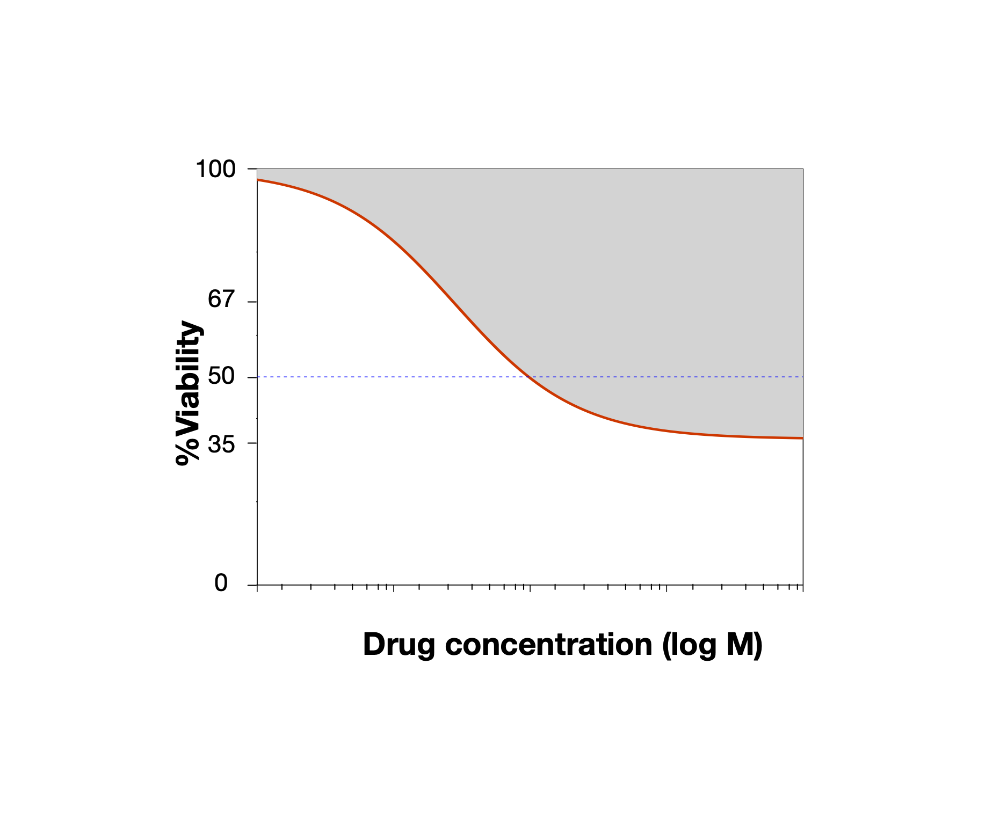

<!-- Remove {-} from header to show numbering -->
# Workshop Overview {-}

*This workshop is currently under development!*

## Instructor(s) name(s) and contact information {-}

* Christopher Eeles <christopher.eeles@uhnresearch.ca>
* Petr Smirnov <petr.smirnov@utoronto.ca>
* Benjamin Haibe-Kains <benjamin.haibe.kains@utoronto.ca>

## Workshop Description {-}

<!-- Alias package links -->
```{r eval=TRUE, echo=FALSE}
PGx <- BiocStyle::Biocpkg("PharmacoGx")
CGx <- BiocStyle::Biocpkg("CoreGx")
```

This workshop will introduce users to the `r CGx` and
`r PGx` R packages, which are useful tools for
pharmacogenomic modelling to discover biomarkers of treatment response in cancer
model systems. `r PGx` specifically focuses on
drug sensitivity experiments in cancer cell lines, which will be the major
focus of this workshop. Additional infrastructure from our lab includes
`r BiocStyle::Biocpkg("ToxicoGx")` for toxicogenomics in healthy human
cell-lines, `r BiocStyle::Biocpkg("RadioGx")` for
radiogenomics in cancer cell-lines and `r BiocStyle::Biocpkg("Xeva")` for
pharmacogenomics in patient derived xenograph (PDX) murine models.

Participants will learn the fundamentals of using `r CGx`
and `r PGx` to create a `PharmacoSet`&mdash;an
integrative container for the storage, analysis and visualization of
pharmacogenomic experiments. Particular focus will be placed
on newly developed support for storing, analyzing and visualizing drug
combination sensitivity experiments and correlating results therefrom for
with multi-omic molecular profiles to discover biomarkers of drug senstivity
or resistance.

### Pre-requisites {-}
  * Basic knowledge of R syntax
  * Knowledge of or interest in pharmacogenomics
  * Familiarity with core Bioconductor classes such as the `SummarizedExperiment`
and `MultiAssayExperiment`
  * Curiosity about or experience with `data.table` an assest!


Useful publications:

* Smirnov, P., Safikhani, Z., El-Hachem, N., Wang, D., She, A., Olsen, C., Freeman, M., Selby, H., Gendoo, D. M. A., Grossmann, P., Beck, A. H., Aerts, H. J. W. L., Lupien, M., Goldenberg, A., & Haibe-Kains, B. (2016). PharmacoGx: An R package for analysis of large pharmacogenomic datasets. Bioinformatics (Oxford, England), 32(8), 1244–1246. https://doi.org/10.1093/bioinformatics/btv723
* Tonekaboni, M., Ali, S., Soltan Ghoraie, L., Manem, V. S. K. & Haibe-Kains, B. Predictive approaches for drug combination discovery in cancer. Brief Bioinform 19, 263–276 (2018).


### Workshop Participation {-}

**Interactive Portion in Development, will be updated when needed.**

<!-- The workshop will be presented as a set of analysis steps to be replicated by the learners, with instructors
available to explain the why and how of applying these functions to the given datasets. Learners will write analysis
scripts as well as use interactive commands to explore the generated data structures and results. Learners will then
brainstorm potential applications of the analysis results in their field as well as comment on use case examples
presented by the instructors on research in our lab. -->


Participants expected to have the following required packages installed on their machines to be able to run the commands along with the instructors:


### _R_ / _Bioconductor_ packages used {-}

Bioconductor:

* https://www.bioconductor.org/packages/devel/bioc/html/CoreGx.html
* https://www.bioconductor.org/packages/devel/bioc/html/PharmacoGx.html

CRAN:

* https://cran.r-project.org/web/packages/data.table/index.html

## Time outline {-}

**Tentative, likely to change!**

For a 1.5-hr workshop:

| Activity                                                   | Time |
|------------------------------------------------------------|------|
| Introduction to CoreGx and PharmacoGx                      |  5m  |
| Overview of Data Structures                                |  15m |
| How TRE Support Drug Combinations Data Analysis            |  10m |
| Using Data Mapper to build a Drug Combo PharmacoSet.       |  10m |
| Dose Response Models and Drug Sensitivity measures         |  10m |
| Drug Combination Synergy Models                            |  10m |
| Biomarker Discovery                                        |  15m |
| Introduction to Resources for Biomarker Validation         |  5m  |


## Workshop goals and objectives {-}

**To Be Updated**

### Learning goals {-}

* Describe pharmacogenomic mono and combination datasets and usefulness in cancer research
* Understand how experimental designs and research questions map onto data structures
* Learn how to extract information from these datasets
* Learn how to visualize experimental results from these datasets
* Learn how to model dose-response for both monotherapy and combination small compound datasets
* Learn measures to quantify response and synergy in cell line sensitivity screens

### Learning objectives {-}

* List available standardized pharmacogenomic and radiogenomic datasets and download them
* Access the molecular features, dose-response and metadata contained within the data structures defined in the packages
* Fit Hill Slope models to dose-response experiments using small compound treatments in cell lines
* Calculate the AAC, AUC, IC50 metrics for response quantification in cell lines
* Predict in vitro univariate biomarkers for drug response and drug synergy using the PharmacoGx


----

# Introduction to CoreGx and PharmacoGx

This tutorial, titled Pharmacogenomic Analysis of Drug Combination Experiments
to Identify Biomarkers of Response or Resistance, focuses on using the
`r BiocStyle::Biocpkg("PharmacoGx")` R package to correlate treatment response,
measured as the viability of cancer cell-lines after _in vitro_ drug treatment,
with their respective multi-omic profiles. `r BiocStyle::Biocpkg("CoreGx")`
provides the core infrastructure for storing, analyzing and visualizing generic
treatment response experiments. It provides functions and classes which can be
inherited in downstream packages, such as `r BiocStyle::Biocpkg("ToxicoGx")` and
`r BiocStyle::Biocpkg("RadioGx")`. We hope that the `CoreSet` object is
generalized enough that it can be reused by other developers for their specific
treatment response use case.

## PharmacoGx

PharmacoGx stores drug screening data together with molecular profiling of
cell lines in an object called a `PharmacoSet`, or `PSet` for short. This object
inherits for the `CoreSet` class defined in our package `CoreGx`, which abstracts
the common functionality across our similar packages.

<!--
## CoreGx

{r coreset,  echo=FALSE, fig.wide=TRUE, fig.cap = "**CoreSet class diagram**. Objects comprising a `CoreSet` are enclosed in boxes. The first box indicates the type and name of each object. The second box indicates the structure of an object or class. The third box shows accessor methods from `PharmacoGx` for that specific object. '=>' represents return and specifies what is returned from that item or method."}
knitr::include_graphics("./CoreSetClassDiagram.png")
-->

### Package Nomenclature

To facilitate modularization of the GxSuite of R packages, we are shifting
the nomenclature within a `CoreSet`&ndash;and therefore in inheriting packages
&ndash;to be more general.

To this end, we are making the following changes:

  * Previous reference to cell (cell-line) will become sample, allowing the
`CoreSet` to be used for other model systems
  * Drug (radiation in `RadioGx`) will become treatment, allowing the
`CoreSet` to be treatment type agnostic
  * Sensitivity will become response (sensitivty slot becomes treatmentResponse)

As a result of these changes, the names of some common accessors will be updated.
The old accessors will still remain, ensuring backwards compatibility for at
least two Bioconductor releases. A deprecation warning will be added to old
accessors informing users of the corresponding new function, as per Bioconductor
best practices.

---
# Overview of Data Structures

The GxSuite of packages make use of various Bioconductor classes for storing
molecular profile data.

## CoreSet

__Need to update the class diagram__

## PharmacoSet

The basic structure of a PharmacoSet is as follows:

<!--
r pharmacoset, echo=FALSE, fig.wide=TRUE, fig.cap = "**PharmacoSet class diagram**. Objects comprising a `PharmacoSet` are enclosed in boxes. The first box indicates the type and name of each object. The second box indicates the structure of an object or class. The third box shows accessor methods from `PharmacoGx` for that specific object. '=>' represents return and specifies what is returned from that item or method."}
knitr::include_graphics("./PharmacoGxClassDiagram.png")

-->

## TreatmentResponseExperiment

```{r treatmentresponseexperiment_class,
  echo=FALSE, fig.wide=TRUE,
  fig.cap = "**TreatmentResponseExperiment class diagram**. Objects comprising a `TreatmentResponseExperiment` are enclosed in boxes. The first box indicates the type and name of each object. The second box indicates the structure of an object or class. The third box shows accessor methods from `PharmacoGx` for that specific object. '=>' represents return and specifies what is returned from that item or method."}
knitr::include_graphics("./TreatmentResponseExperimentClassDiagram.drawio.png")
```

----

# How TRE Support Drug Combinations Data Analysis

## Drug Combination Experiments

The field of precision oncology is increasingly interested in exploring possible
synergies between cancer therapies. To simplify the process of translating
drug combination experiments conducted in cancer model systems, we have extended
the `CoreSet` and `PharmacoSet` classes with a new object, the
`TreatmentResponseExperiment`, which has been specifically designed to handle
combination experiments. While drug combinations are the first use case for
this data structure, as cancer model systems continue to advance we expected
to also see sample-wise combinations. For example, 3D organoid models could
include multiple cell-lines or patient tissue types.

## Using Data Mapper to build a Drug Combo PSet

### Data Mapper

### Combining with Omics Data into a PharmacoSet

----

# Dose Response Models and Drug Sensitivity Measures

Understanding monotherapy dose-viability data is an important step in assessing drug combination response. Drug synergy is assessed by
comparing the observed combination response compared to what is expected from the response of cells to each drug separately. While
different models for "expected" combination effect will be discussed in the next section, we first review how monotherapy data is analyzed.

Monotherapy dose-response experiments are usually analyzed by first fitting a dose-viability model to the observed measurements.
The most common model used in the literature is a form of sigmoid function, called the Hill Curve. The Hill Curve has its
basis in the Michaelis-Menten chemical kinetics model, while adding an extra parameter to account for co-operativity of binding.
To better match real observed data, the model can also be extended to include parameters controlling the maximum and minimum observed
viability.

_NB: Sometimes, dose-viability and dose-response curves are used interchangebly in the literature. Precisely, dose-response curves
for a cell kiling screen would plot % cell death against dose, leading to an increasing sigmoid curve._

In `PharmacoGx`, we use the 3 Parameter Hill Curve
function as our model of drug response in cancer cell lines:

$$y = E_\infty + \frac{1-E_\infty}{1 + (\frac{x}{EC50})^{HS}}$$
This is a log-logistic model, meaning that it takes the form of a logistic curve when x is on the log scale.
The three parameters are:
$E_\infty$, which is the maximal inhibition predicted at infinite concentration of the drug (the right asymptote);
$EC50$, which is the inflection point of the logit, where the inhibition reaches 50% of the maximum;
$HS$, the Hill Slope, which is a measure of the cooperativity of binding. This parameter controls the steepness
of the logit, and is interpreted based on its relation to 1. Values larger than 1 imply positive cooperativity in
inhibition/binding of the target for the small molecule ligands, which values less than 1 imply negative cooperativity/antagonism.


```{r hillSlopeFig, fig.cap="Diagram of a logLogistic Hill Slope", echo=FALSE}
library(PharmacoGx)

```


PharmacoGx provides functions to both fit and visualize dose-viability curves. Plotting dose-viability data is easy using the
`drugDoseResponseCurve` function:


```{r ddrc_own}
concentrations <- 1/2^seq(0,8) * 1
viabilities <- c(0.1, 5, 15, 23.8, 55.2, 85.9, 96.9, 98.4, 99.2)

drugDoseResponseCurve(concentrations = list("Exp 1" = concentrations), viabilities = list("Exp 1" = viabilities), plot.type = "Both")
```

Similarly, fitting Log-Logistic models to data is simple using the `logLogisticRegression` function in `PharmacoGx`.

```{r loglogistic}
concentrations <- 1/2^seq(0,8) * 1
viabilities <- c(0.1, 5, 15, 23.8, 55.2, 85.9, 96.9, 98.4, 99.2)

pars <- logLogisticRegression(conc = concentrations, viability = viabilities)
print(pars)
```

Note that sometimes, it is may be more appropriate to use either a 2 parameter model (excluding the $E_\infty$ parameter), or a
4 parameter model, including a parameter for the left-assymptote, that is, the measurement when no drug is added. `PharmacoGx` is opiniated
in using the 3 parameter model, as the logical value for the viability as a percentage of untreated cells when no drug is added is 100%.
However, the `drc` CRAN package provides a larger variety of dose-response models, should it be appropriate in your application.


We will soon demonstrate how to apply the `logLogisticRegression` to dose-viability data stored in a `TreatmentResponseExperiment`,
but first we will talk about how to summarize dose-response curves for downstream analysis.


### Computing Summary Measures for DDRCs

Often with _in vitro_ Pharmacogenomics data, we want to compare the drug sensitivity of a cell line
to some omic features. For this, we want to summarize the drug dose response curve into a single
number representing the sensitivity of the cell line.

```{r hillSlopeSumFig, fig.cap="Some commonly used summary metrics for a dose-response curve", echo=FALSE}
knitr::include_graphics("./hillSlopeSummary.png")
```


The IC50 and Area Above the Curve are two
convenient metrics for quantifying the observed drug sensitivity. If you noticed above,
the `drugDoseResponseCurve` function computes them by default. In PharmacoGx, they can be
computed manually as follows:

```{r sens_own}
concentrations <- 1/2^seq(0,8) * 1
viabilities <- c(0.1, 5, 15, 23.8, 55.2, 85.9, 96.9, 98.4, 99.2)

print(PharmacoGx::computeAUC(concentration = concentrations, viability = viabilities))
print(PharmacoGx::computeIC50(concentration = concentrations, viability = viabilities))
```

If measurements are passed into these function, the Log Logistic model is fit to compute the IC50 and AAC.
Clearly, if multiple metrics are being computed, redoing the fit is inefficent. Therefore, these functions
can also take parameters fit by `logLogisticRegression`.

```{r sens_own_fit_first, eval=FALSE}
concentrations <- 1/2^seq(0,8) * 1
viabilities <- c(0.1, 5, 15, 23.8, 55.2, 85.9, 96.9, 98.4, 99.2)
pars <- logLogisticRegression(conc = concentrations, viability = viabilities)

print(PharmacoGx::computeAUC(concentration = concentrations, Hill_fit = pars))
print(PharmacoGx::computeIC50(concentration = concentrations, Hill_fit = pars))
```


### Processing Monotherapy Data With the TRE

Usually, we will have more than one dose-viability experiment we wish to analyze at a time. 


```{r fitting_and_aac_tre, eval=FALSE}

## TODO: write me

```

# Drug Combination Synergy Models

When assessing drug combinations, the question of interest is usually not to quantify drug response to the therapy,
but to identify combinations that give more or less response to therapy than expected from the monotherapy regiments,
that is, to look for synergy or antagonism. Alternatively, for a paritcular drug combination, we may be interested to 
identify which biological models show synergy or antagonism, and understand why that could be the case on a molecular level. 

For these tasks, it is important to define what we expect the result of combining two drugs at a particular combination to 
be without the presence of any synergy or antagonism between them. Usually, when searching for synergy,
will have access to experiments testing each drug in monotherapy, as well as the drugs in combination. For our discussion, we
we restrict ourselves to the two-drug combination case, however, the principles we discuss can be extended to handle multiple 
drugs. 

Unfortunately, there is no consensus of what the theoretical expected value of response for combining two drugs is, given the
response that each drug elicits in monotherapy. However, there are three models widely applied in the literature, each with  
different biological assumptions behind them. 

To introduce these models, we will define some mathematical notation, which we will use both throughout our exposition and the 
example computations. Let $x_{1}$, and $x_{2}$ correspond to the corresponding drug 1 and drug 2 doses at which we wish to predict 
the expected combination response. Let $v_{1}$ and $v_{2}$ be the viabilities that are observed in monotherapy for these drugs, and 
$v_{c}$ be the viability observed in combination. Furthermore, let $r_{i} = 1 - v_{i}$ be the response value corresponding to each 
measured viability. We will use both response and viability measurements in explaining the models, as some are more natural from one 
or the other perspective. However, it is easy to convert between these variables using the relationship above. 

When we look for drug synergy, we are looking for cases where $v_c < v_{model}$, or $r_c > r_{model}$. The degree of synergy 
is usually measured either on the additive or multplicative scale, that is, looking at either $v_c - v_{model}$ or $v_c / v_{model}$.
However, some models, such as the ZIP described below, also perscribe a certain perspective to assess synergy. 

## Highest Single Agent / Highest Single Effect

The simplest model that one can assume for the response of drugs in combination is the Highest Single Agent model. This model predicts 
that the result of treating with two drugs is the same as the highest response (or lowest viability) seen by treating with either drug 
independently. Mathematically, this is equivalent to:

$$HSA((r_1,x_1), (r_2,x_2)) = \mbox{max}(r_1, r_2)$$

For viability values, this flips to a minimum. 

Intuitively, this model can be interpreted as assuming that one compound is at the maximum possible effect, and the other is 
treated as a potentiator, contributing little to the response itself, but allowing the maximum response of the first drug to 
be increased. Practically, this case is not very often observed during in-vitro dose-response experiments, and the highest 
single agent model is often a very weak baseline from which to compute synergy. 

## Bliss Independence

Bliss Independence can be understood by making the assumption that cell death from treatment with a drugs is a stochastic process
with the probability of cell death being proportional to the response observed in the experiment. The model than assumes that the
cell death events from the two drugs are independent, for example because they occur through completely separate pathways. As such, 
the model predicts that adding a second drug will kill the same fraction of cells as it kills on its own, and therefore the fractions
of cells remaining alive are caculated by multplying the fraction of cells alive after treatment with drug 1 in monotherapy, 
with the fraction of cells alive after treatment with drug 2 in monotherapy. Mathematically, that works out to:

$$BLISS((v_1,x_1), (v_2,x_2)) = v_1 v_2$$

In response units this is:

$$BLISS((r_1,x_1), (r_2,x_2)) = r_1 + r_2 - r_1*r_2$$ 

This model is always going to be more strict that HSA (as long as response is between 0 and 1), and is usually a more practical assumption
to make when searching for drug synergy. Intuitively, one can think of it as modeling the case where the two drugs have separate mechanisms, 
with synergy signifiying a biological interaction that makes them more effective than expected. 

## Loewe Additivity

Loewe Additivity comes from a different assumption on what the effect of adding two drugs should be. While Bliss Independence assumes that the 
drugs act independently, for example through different pathways, Loewe assumes that in the null case, adding $x_2$ concentration of a second drug 
should lower the viability as if we added a proportional amount of the same drug, with that proportion caculated according to the relative efficacy
of the two drugs at the final combination viability. This proportinal relationship is defined implicity at each predicted value of $v_{loewe} 
by the following formula:

$$ \frac{x_1}{X^{loewe}_1} + \frac{x_2}{X^{loewe}_2} = 1$$

where $ X^{loewe}_1 $ is the concentration of drug 1 required to achieve $v_{loewe}$ on its own, and similarly for $ X^{loewe}_2$ and drug 2. 
Translating this to english, it assumes that we can lower the concentration of drug 1 needed to see the same effect by replacing the missing 
dose with a similar amount of drug 2, adjusted for the difference in potency between the two drugs. 

Practically, this formula is not very useful for estimating $v_{loewe}$ from actual dose-response data. However, if we assume that drug response 
follows a Hill Curve model, we can define $y_{loewe}$ implicitly using the parameters $HS_{1}$, $EC50_{1}$, 
and $E_{\infty,1}$, and $HS_{2}$, $EC50_{2}$, and $E_{\infty,2} by rearranging the Hill Curve relationship as follows:

$$ x = EC50 * (\frac{v-1}{v-E_{\infty}})^{\frac{1}{HS}}$$

We can then plug this relationship in to get an emplicit formula for $v_{loewe}$:

$$ \frac{x_1}{EC50_1 * (\frac{v_{loewe}-1}{v_{loewe}-E_{\infty,1}})^{\frac{1}{HS_1}}} + \frac{x_2}{EC50_2 * (\frac{v_{loewe}-1}{v_{loewe}-E_{\infty,2}})^{\frac{1}{HS_2}}} = 1$$

This formula can then be solved numerically in practice to find the value of $v_loewe$ for any two particular fitted curves. 

<!-- TODO: write up combination Index -->

## ZIP

The Zero interaction Potency model was recently introduced with the goal of capturing the ideas behind both the Bliss and Loewe assumptions. As the name implies
the model assumes that the two drugs do not "potentiate" each other, meaning, that the only difference between the dose response curves of Drug 1 with and without 
Drug 2 present is that the presence of Drug 2 changes the baseline response, without affecting the potency of Drug 1. The authors were then able to show that 
the ZIP model can be derived from multiplying the two fitted Dose-Response curves together.  
<!-- TODO: Finish me  -->


## Picking a Null Drug Combination Model

Given the fact that there is no universal consensus on which null model is correct in all cases, when analyzing drug combination data, a choice must be made 
by the analyst. Ideally, this choice would be made according to reasonable assumptions about the drugs and their mechanisms of action. For example, for two compounds
which inhibit targets converging on the same pathway, the Loewe model may be most appropriate, whereas for drug combinations with completely unrelated mechanisms, Bliss
may be a more natural choice. 

However, practical considerations may also limit your choices. For both the Loewe and ZIP approaches, one needs enough points to be measured to be able to fit Hill Curves 
to the available data. For Loewe, this needs to be done only in monotherapy, while for ZIP, both monotherapy and combination data must have sufficient points to fit a curve. 
On the other hand, both HSA and Bliss can be computed from the raw measurements of monotherapy viability, not requiring any models of the dose-response data to be fit. 

In general, we would recommend using a model which makes stronger assumptions than HSA, which is the weakest of the presented models. If the number of tested 
doses is low (<6), the Bliss model is probably the reference of choice, even though it is know to be quite strict. When possible to calculate, the ZIP 
approach has advantages in a high-throughput setting, where it would be difficult to pick between Bliss and Loewe a-priori for each individual combination. 


## Quantifying Synergy or Antagonism Compared to a Null Model

Once a null model is chosen, the expected combination viability or response is compared to the observed value, as mentioned above. For all methods, this can be done 
using either a difference, or a ratio. In addition, the Loewe model directly facilitates calculating the Combination Index described above, and the ZIP model defines 
the $\delta$ score for quantifying synergy. The main practical consideration when choosing how to compare the observations to the null is the scale on which results 
will be interpreted or further analyzed. Taking the ratio of $v_c/v_{model}$, or using the Combination Index for Loewe leads to values that lie in ${0, \infty\]$ 
(with 1 as the reference for no syngergy or antagonism), similar to fold changes. On the other hand, both differences and the ZIP $\delta$-score lie on a bounded scale $\[-1,1\]$, 
with 0 as the reference. 

If the goal is simply to identify whether there was synergy or antagonism observed at a certain dose, the last step would be to visualize the results, and examine the extent 
of deviation from the null model. For this, the scale chosen is a matter of preference. However, if the downstream goal is biomarker discovery using a summary of synergy for 
each model tested with a particular combination, if the Combination Index or a ratio is used, it may be more appropriate to analyze the results on a log-scale, as otherwise
the range is unbalanced around the reference. 

In practice, our preference is to use the absolute deviation from the Bliss predicted value for downstream analysis, or, when 


NB: Usually, the monotherapy response will be a subset of the full combination dose-response matrix, and therefore, will have been measured on the same doses. If this is not the case,
it may be necessary to fit a Hill Curve model even when using the Bliss or HSA approaches, to interpolate what the observed monotherapy viability should be at the doses used in the combination 
experiment. 

## Calculating Synergy Surfaces using a Treatment Response Experiment

```{r}
library(CoreGx)
library(PharmacoGx)
library(data.table)
library(BiocParallel)
library(doParallel)

# Load example assay
NCI.PSet <- readRDS(file.path("vignettes/NCI_ALMANAC_2017.rds"))

NCI.TRE <- treatmentResponse(NCI.PSet)

## TreatmentResponseExperiment method
bench::system_time({
NCI.TRE |>
  subset(is.na(treatment2dose)) |>
  aggregate(
    assay = "sensitivity",
    auc = PharmacoGx::computeAUC(treatment1dose, viability),
    by = c("treatmentid1", "sampleid"),
    nthread = 4
  ) ->
NCI.TRE$mono_auc
})


# debug(aggregate2)

# data.table aggregation
sens[is.na(drug2dose)] |>
  aggregate2(
    mv = mean(viability), mean(drug1dose),
    by = c("drug1id", "drug2id", "cellid")
  )

## MultiCoreParam
bp <- bpparam()
bench::system_time({
  sens |>
    subset(is.na(drug2dose)) |>
    aggregate2(
      auc = PharmacoGx::computeAUC(drug1dose, viability),
      by = c("drug1id", "cellid"),
      BPPARAM = bp, nthread = 22
    ) ->
  auc_dt
})

## SnowParam
bp1 <- SnowParam()
bench::system_time({
  sens |>
    subset(is.na(drug2dose)) |>
    aggregate2(
      auc = PharmacoGx::computeAUC(drug1dose, viability),
      by = c("drug1id", "cellid"),
      BPPARAM = bp1, nthread = 22
    ) ->
  auc_dt
})

## DoParParam - should be faster than MultiCoreParam
registerDoParallel(22)
bp2 <- DoparParam()

bench::system_time({
  sens |>
    subset(is.na(drug2dose)) |>
    aggregate2(
      auc = computeAUC(drug1dose, viability),
      by = c("drug1id", "cellid"),
      BPPARAM = bp2, nthread = 22
    ) ->
  auc_dt
})

## Apples to apples comparison (hopefully)
bmark <- bench::mark(
  mutl = {
    sens |>
      subset(is.na(drug2dose)) |>
      aggregate2(
        auc = computeAUC(drug1dose, viability),
        by = c("drug1id", "cellid"),
        BPPARAM = bp, nthread = 22
      ) ->
    auc_dt
  },
  dopar = {
    sens |>
      subset(is.na(drug2dose)) |>
      aggregate2(
        auc = computeAUC(drug1dose, viability),
        by = c("drug1id", "cellid"),
        BPPARAM = bp2, nthread = 22
      ) ->
    auc_dt
  }
)

library(CoreGx)
library(data.table)
tre <- qs::qread(
  file.path(".local_data", "nci_treatment_response_exp.qs"),
  nthread = 10
)
# data(nci_TRE_small)
# fix use of wrong column for sensitivity
# tre$sensitivity <- tre$sensitivity[,
#     `:=`(PERCENTGROWTH=viability, viability=(TESTVALUE/CONTROLVALUE)*100)
# ]
tre |>
  subset(is.na(drug2id)) |>
  aggregate(
    assay = "sensitivity",
    viability = mean(viability),
    by = c("drug1id", "drug1dose", "cellid")
  ) |>
  aggregate2(
    {
      fit <- tryCatch(
        {
          PharmacoGx::logLogisticRegression(drug1dose, viability)
        },
        error = \(e) list(HS = NA_real_, E_inf = NA_real_, EC50 = NA_real_)
      )
      ic50 <- tryCatch(
        {
          PharmacoGx::computeIC50(drug1dose, Hill_fit = fit)
        },
        error = \(e) NA_real_
      )
      auc <- tryCatch(
        {
          PharmacoGx::computeAUC(drug1dose, Hill_fit = fit, area.type = "Fitted")
        },
        error = \(e) NA_real_
      )
      list(
        HS = fit[["HS"]], E_inf = fit[["E_inf"]], EC50 = fit[["EC50"]],
        Rsq = as.numeric(unlist(attributes(fit))),
        auc = auc,
        ic50 = ic50
      )
    },
    by = c("drug1id", "cellid"),
    enlist = FALSE,
    nthread = 20
  ) -> mono_profiles
tre$mono_profiles <- mono_profiles

# -- extract monotherapy drug observations
## FIXME:: This drops the aggregations attribute... Do we need it?
mono_profiles <- tre$mono_profiles
## TODO:: Add helper methods to make finding these columns easier!
mono_cols <- setdiff( # identify assay specific columns
  colnames(mono_profiles),
  c(colnames(rowData(tre)), colnames(colData(tre)))
)
mono_profiles <- unique(mono_profiles[
  !is.na(HS) & Rsq > 0.75, # drop failed fits and not passing Rsq test
  mget(setdiff(mono_cols, c("auc", "ic50"))),
  by = c("drug1id", "cellid")
])

# -- build out combination modelling table with dose! Needed for Loewe
combo_profiles <- tre$sensitivity[
  !is.na(drug2id),
  .(
    mean_viability = mean(viability),
    mean_drug1dose = mean(drug1dose),
    mean_drug2dose = mean(drug2dose)
  ),
  by = .(drug1id, drug2id, cellid)
]
# TODO:: Do we want to keep NA values? Add all.x=TRUE if so.
combo_profiles <- merge.data.table(
  combo_profiles, mono_profiles,
  by = c("drug1id", "cellid")
)
combo_profiles <- merge.data.table(
  combo_profiles, mono_profiles,
  by.x = c("drug2id", "cellid"), by.y = c("drug1id", "cellid"),
  suffixes = c("_2", "_1")
)
setkeyv(combo_profiles, c("drug1id", "drug2id", "cellid"))
setcolorder(combo_profiles, c("drug1id", "drug2id", "cellid"))

# -- compute synergy metrics
## Here score ~ combination index
combo_profiles |>
  aggregate2(
    {
      # predict single agent viability for this combo
      v1 <- min(PharmacoGx:::.Hill(
        log10(mean_drug1dose),
        c(HS_1, E_inf_1, log10(EC50_1))
      ) / 100, 1)
      v2 <- min(PharmacoGx:::.Hill(
        log10(mean_drug2dose),
        c(HS_2, E_inf_2, log10(EC50_2))
      ) / 100, 1)
      # alias variables for readable math
      v <- min(mean_viability / 100, 1)
      r1 <- 1 - v1
      r2 <- 1 - v2
      r <- 1 - v
      rmax1 <- 1 - (E_inf_1 / 100)
      rmax2 <- 1 - (E_inf_2 / 100)
      rmin <- 0
      # do math
      HSA <- max(r1, r2)
      HSA_score <- HSA / r
      BLISS <- r1 + r2 - (r1 * r2)
      BLISS_score <- BLISS / r
      LOEWE_1 <- (d1 / EC50_1) * (1 / ((emin1 - v) / (v - emax1))^(1 / HS_1))
      LOEWE_2 <- (d2 / EC50_2) * (1 / ((emin2 - v) / (v - emax2))^(1 / HS_2))
      LOEWE_score <- LOEWE_1 + LOEWE_2
      # return list
      list(
        r1 = r1, d1 = mean_drug1dose, d2 = mean_drug2dose, r2 = r2, r = r, HSA = HSA, HSA_score = HSA_score, BLISS = BLISS,
        BLISS_score = BLISS_score,
        LOEWE_score = LOEWE_score
      )
    },
    by = c("drug1id", "drug2id", "cellid"),
    enlist = FALSE,
    nthread = 1
  ) -> prof2

## PERCENTGROWTHNOTZ has missing values
## compute viability from T_72 / C_72
viability <- tre[["sensitivity"]][,
  c(idCols(tre), "TESTVALUE", "CONTROLVALUE"),
  with = FALSE
]
## We have negative TESTVALUE => nagtive viability, meaning
## blank absorbance reading is for some reason higher than the sample
## either because the measurements are close to machine error value
## or the blank was contaminated
viability[TESTVALUE < 0, ]
## negative TESTVALUE in a very marginal range, replace them with 0
viability[TESTVALUE < 0, TESTVALUE := 0]
## logLogisticRegression will bark for viability exceeding negative control
viability[, `:=`(
  viability = ifelse(
    TESTVALUE > CONTROLVALUE,
    100, ## Cap E_min with 100
    (TESTVALUE / CONTROLVALUE) * 100
  ),
  TESTVALUE = NULL,
  CONTROLVALUE = NULL
)]
tre[[".viability"]] <- viability
mono_response <- viability |> getMonoResponse()
# mono_params <- qs::qread("/home/lifeifei/data/mono_params.qs")
mono_params <- mono_response |>
  aggregate2(PharmacoGx::logLogisticRegression(dose, avg_viability),
    by = c("drugid", "cellid"), enlist = FALSE
  ) ## should run without warnings or errors

combo_response <- tre[["sensitivity"]][
  !is.na(drug1id) & !is.na(drug2id),
  c(idCols(tre), "TESTVALUE", "CONTROLVALUE"),
  with = FALSE
][
  ,
  `:=`(
    viability = ifelse(
      TESTVALUE > CONTROLVALUE,
      100, ## Cap E_min with 100
      (TESTVALUE / CONTROLVALUE) * 100
    ),
    TESTVALUE = NULL,
    CONTROLVALUE = NULL
  )
][,
  viability := mean(viability),
  by = .(drug1id, drug2id, drug1dose, drug2dose, cellid)
][, replicate_id := NULL]

loewe_input <- combo_response[mono_params,
  on = c(drug1id = "drugid", cellid = "cellid")
]
param_names <- setdiff(colnames(loewe_input), colnames((combo_response)))
setnames(loewe_input,
  old = param_names,
  new = paste(param_names, "1", sep = "_")
)
loewe_input <- loewe_input[mono_params,
  on = c(drug2id = "drugid", cellid = "cellid")
]
setnames(loewe_input,
  old = param_names,
  new = paste(param_names, "2", sep = "_")
)
loewe_input <- loewe_input[!is.na(viability)]
effectToDose <- function(E, HS, EC50, E_inf) {
  return(
    EC50 * (100 - E) / (E - E_inf)
  )
}
computeLoewe <- function(dose1, dose2, HS_1, HS_2, E_inf_1, E_inf_2, EC50_1, EC50_2, E) {
  ## TODO:: this merely computes Loewe combination score
  ## need to find a way to estimate E_loewe
  dose_ratio_1 <- dose1 / effectToDose(E = E, HS = HS_1, E_inf = E_inf_1, EC50 = EC50_1)
  dose_ratio_2 <- dose2 / effectToDose(E = E, HS = HS_2, E_inf = E_inf_2, EC50 = EC50_2)
  CI <- dose_ratio_1 + dose_ratio_2
  return(CI)
}

Loewe_CI <- loewe_input |>
  aggregate2(
    Loewe_CI = computeLoewe(
      dose1 = drug1dose,
      dose2 = drug2dose,
      HS_1 = HS_1,
      HS_2 = HS_2,
      E_inf_1 = E_inf_1,
      E_inf_2 = E_inf_2,
      EC50_1 = EC50_1,
      EC50_2 = EC50_2,
      E = viability
    ),
    by = c(
      "drug1id",
      "drug2id",
      "cellid",
      "drug1dose",
      "drug2dose",
      "viability"
    )
  )

```


# Biomarker Discovery:

## Monotherapy response

## Combination Synergy

----

# Introduction to Resources for Biomarker Validation


----

# References


# SessionInfo

```{r session_info, include=FALSE}
sessionInfo()
```